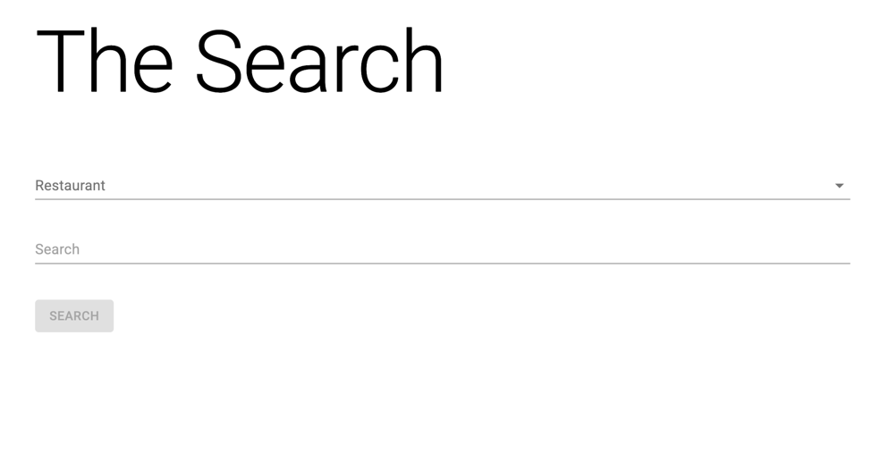
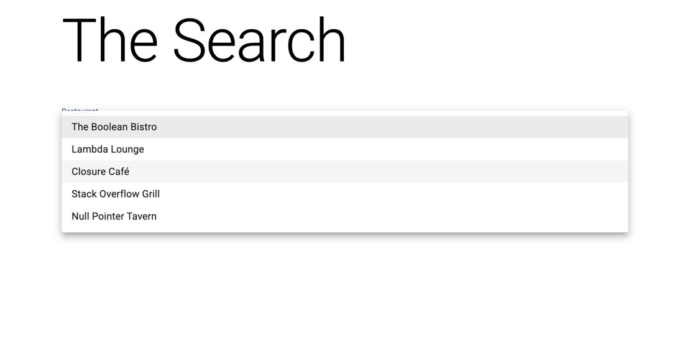
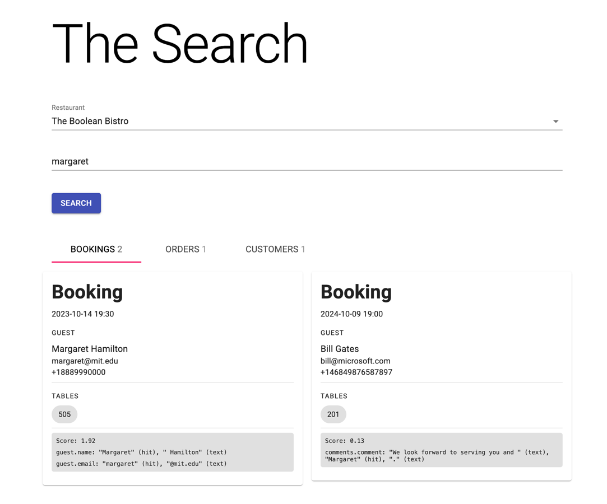
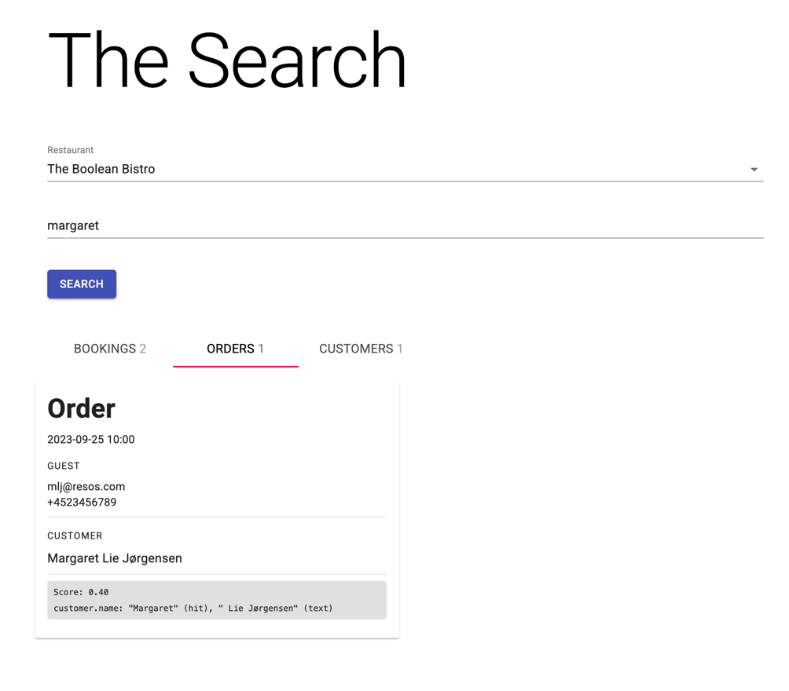
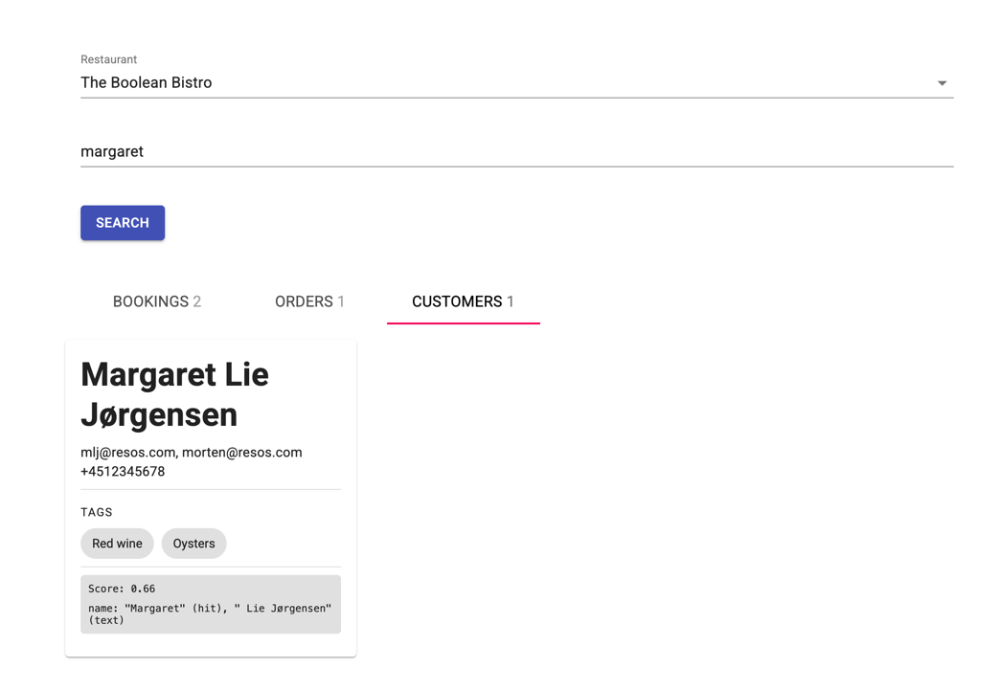

# Senior Developer Test

This was fun! I haven't used Meteor before. I'm happy to say it was fairly simple to get started with.

I probably spent a bit more time than I should on setting up a local environment and a cluster in Atlas. I learn best by
doing/trial and horror, so I felt it was worth it. Probably wouldn't have been able to deliver anything close to what
you want otherwise!

### General notes

- Time spent on each task is excluding environment setup
- I've used Typescript throughout the tests

---

## 1. Refactor legacy React component and Meteor method

Fairly straightforward in general, although I had to do some research on the `@material-ui` lib (I've used Material UI
in the past, but in Angular).
I have not run the code so maybe there are some mistakes, but I hope it's close enough for the purpose of this test.

### AreaForm

> `imports/ui/components/Tables/AreaForm.tsx`

- Converted to functional component
- Didn't find any big issues, but maybe I focused more on code structure than actual functionality
  - Added a missing aria-label to the `Dialog` component
- Changed the style handling from HOC to hook
- Omitted the `withMobileDialog` HOC, as it didn't seem needed when I reviewed the docs—I might be wrong here though
- I'm not sure how the i18n should be setup so I followed the "Here is the most _"React-way" solution facilitating React
  Context"_ approach at https://github.com/vazco/meteor-universe-i18n?tab=readme-ov-file#integrations
- Added `async await` handling of the meteor call, not necessarily because it's better, but just because I like it.
  Guessing there'd be a more generic way of doing this in a fully fledged app (or something in meteor). Just wanted to
  get a bit closer to "my way" of doing things :)
  - Also wrapped in a `try/catch` to facilitate the error handling (both callbacks did the same on error so seemed
    like an improvement handling in one place)

#### Difficulty

2

Really a 1, but bumped it to 2 since I had to do some research on the `@material-ui` lib.

#### Time

~1 hour

---

## methods.js

> `imports/api/SeatingAreas/server/methods.ts`

- Read in the Meteor docs that one should use `updateAsync`/`insertAsync` instead of `update`/`insert` on the server
  side so changed that.
- Changed the `// Update area name on future bookings if it changed` to use `updateAsync` and await it, since the
  `update` method wasn't present on the `rawCollection`.

### Difficulty

1

### Time

~0.5 hour

---

## 2. MongoDB Search

Alright. I spent a bit more time on this one. Considered different approaches and ended up using **Atlas Search**.

> Caveat: I have not taken potential costs into consideration. Maybe Atlas Search becomes expensive (I don't know) and
> there are more cost-effective alternatives. I focused solely on achieving a good search experience.

### Preparations

- I created a new cluster in Atlas, running MongoDB 6.0.
- I took some help from my pal GPT and generated some test data. You can find the data in the `other/seed` folder.
- I've created types based on the data you provided in the document. You can find them in the `types` folder.

### SearchMethods.ts

> `imports/api/Search/server/SearchMethods.ts`

- I set up three indexes: `order-search`, `customer-search` and `booking-search`.

  - I've stored the `JSON` definitions in the `other/indexes` folder if you want to take a look. For example, this is what the `customer-search` looks like:

  ```json
  {
    "mappings": {
      "dynamic": false,
      "fields": {
        "name": {
          "type": "string"
        },
        "emails": {
          "type": "string"
        },
        "phones": {
          "type": "string"
        },
        "note": {
          "type": "string"
        },
        "tags": {
          "type": "string"
        }
      }
    }
  }
  ```

- I included fields that seemed relevant to the search, however this is something that would need more domain and user
  knowledge to get right.
- I considered using fuzzy search but felt that with the number of fields being searched, the result was too vague in
  combination with fuzzy search.
  - Perhaps we could use fuzzy on certain fields, and not others, to get a better result.
- The restaurantId is used as a `$match` condition in the query, so that the search is limited to the current
  restaurant.
- I've included the `score` and `highlights` meta fields in the results, and sort on the `score` in descending order.
  - I'd also want to weigh the fields differently when sorting, so that more relevant results are shown first, but I didn't have time to get into this for now.

### Search.tsx

> `imports/ui/components/Search/Search.tsx`

- I created a `Search` component that calls the `search.query` method in SearchMethods and renders the results in tabs
- The restaurant is selected in a `Select` component—if this is a big list in reality, an `Autocomplete` would probably
  be better. But for this test, `Select` does the job.
  - Just a note: In a production app, I would perhaps have gone for a "Chip list", or similar, over a Select or
    Autocomplete, as I find that often more user-friendly.
- I created very simple `Card` components for each entity, that are rendered in a `Grid` as search results.
  - I didn't spend much time on styling or picking the most appropriate fields to display, so they probably leave a
    lot to be desired :)
  - For the sake of evaluation, I included a small block showing the `score` and `highlights` meta fields for each
    hit.
- I have not implemented some of the boilerplate required for a production solution, like pagination/infinite
  scrolling, error handling, empty state etc.

I've included screenshots of the search page, since you probably won't run the app. Not sure they embed properly in the
readme, go to `other/search-screenshots` if you want to take a look.







#### Difficulty

3

New stuff! The UI bit was simple (although I might not agree with Material UI all the time :D ). The search part wasn't
too difficult either, but it took some time setting up in Atlas and testing and tuning to get it right.

#### Time

~2 hours

## 3. Solution architecture

Well. One way to go is to use an external service. I'd recommend Klaviyo. I've used it for a few projects (mostly
webshops) and I have had good experiences with it.

But I suppose that's not the point of this test :)

### How I'd do it

I'd create a `newsletterSubscribers` collection with primarily the restaurant reference, recipient email address and
subscription status, and potentially reference related customer/guest objects, or orders and bookings it stemmed from.

I'd also create a `emails` collection, storing each email with a reference to the newsletter subscriber and information
about the email i.e. status, subject etc.

How much information to be stored in the `sentEmails` documents depends a lot on the sending service. Because I wouldn't
build the sending logic myself, I'd shop for a good service that can handle that for us, like **SendGrid** or **MailerSend**. These services most often also include tracking and a copy of the email, which we could rely on if we
don't want to store it ourselves.

How to handle sending in bulk also depends on the service we choose. Some services handle throttling and warming up of
domains automatically, so we don't have to worry about that, but others don't. In case we have to handle those kind of
things ourselves, we'd have to have a solution for sending the emails in batches. For the first sendouts for a domain,
we'd also have to make sure we don't send too many emails in a short period of time, to avoid being blocked/blacklisted,
so we'd need a ramping up strategy for the batches. There are many different strategies for the batching, but one I've
used before and that is simple, is to have a cron job that fetches unsent emails from the `emails` collection, and use
an `emailBatchSize` and a `batchSendingDelay` property for each restaurant (or perhaps in a dedicated `sendingDomain`
collection, if restaurants have different sending domains) to inform how many emails to send in a batch and how long to
wait before sending the next batch.

We may also have to build a UI for handling unsubscribes, however this is also something that may be handled by the
sending service.

For the restaurants websites, we'd create an embeddable component, e.g. a modal popup, that they can add to their
website to recruit subscribers.

We'd have to make sure that the sign up is compliant with GDPR and other regulations in different countries. E.g. Some allow "soft opt-in" while others require a "hard opt-in".

For the sake of maintaining a good quality of the email lists, we'd probably want to have a confirmation email sent to the subscriber, to make sure they've provided real email addresses. This could be optional for the restaurants, but would have an impact on their deliverability to different email providers if they have a lot of bounces.

For our UI, we'd need an email editor of some kind. This is a task where we could spend a lot of time unless we scope
it carefully before we start. We could go for an external service for this as well, or we could leverage one of the
WYSIWYG libraries out there (I've had good experiences with TipTap, although not specifically for emails). Or we might be
satisfied with a few hard coded HTML templates with some slots for dynamic content.
One thing to keep in mind if we build it ourselves, is that email markup and styling is not the same as web markup and
styling.

And of course, we'd need some way of setting up sendouts, manage subscribers, view stats and so on. I won't go into the
UI here, as I feel I'm already getting lengthy with my answer :)

### Considerations

- What's the ambition level? E.g. do we want to build the latest and greatest features, or do we want to focus on a
  simple and easy to use solution?
- How much do we want to build on our own, vs leverage external services? And why?
- Evaluate sending services
- Evaluate email editor alternatives
- Research what's needed to comply with GDPR and other regulations in different countries

### Process

I'd probably suggest something like this:

1. MVP
   1. Create database collections/schemas
   2. Set up sending service
   3. Create a simple UI for creating sendouts/campaigns/newsletters
   4. Start with a simple hard coded email template
   5. Initially, collect subscribers via resOS UI
   6. Start sending!
2. Embeddable component
   1. To start collecting subscribers on the restaurant websites

At this point, it's a matter of what is most relevant to the business:

- Proper email editor
- Better UI for analytics
- Better UI for managing sendouts
- etc
